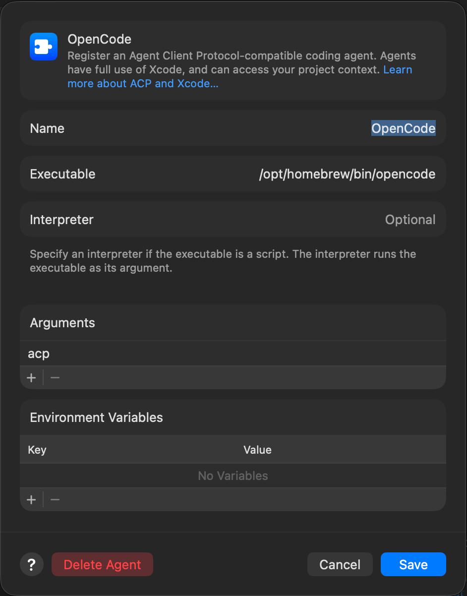

# Mac Admin Inspector

Mac Admin Inspector je malý local-first SwiftUI Lab pro **Apple Admin Days**. Účastníci s pomocí AI asistenta rozšiřují inventarizaci macOS o úzce vymezené funkce pouze pro čtení.

## Účel a struktura dokumentace

- [AGENTS.md](AGENTS.md) obsahuje závazná provozní pravidla pro agenta a práci v projektu.
- [SPECIFICATION.md](SPECIFICATION.md) je implementační kontrakt jednotlivých funkcí: zdroje dat, hranice, architektura a akceptační kritéria.
- Tento README je workshopový průvodce. Popisuje cíl cvičení a obsahuje krátké prompty; nemá opakovat implementační detaily ze specifikace.

## Výchozí aplikace

Aplikace cílí na macOS 14+ a obsahuje:

- **Overview** — lokální profil zařízení: hardware, macOS, úložiště, doba běhu, Rosetta a dostupné údaje o baterii.
- **Network** — lokální aktivní rozhraní, adresy, DNS a Wi-Fi údaje, pokud je macOS poskytne.
- specializované Foundation služby; SwiftUI pohledy neprovádějí systémové dotazy ani parsování.

Podrobná pravidla těchto funkcí jsou ve SPECIFICATION.

## Workshop

Každé cvičení řeš samostatně. Prompt určuje cíl; přesné funkční požadavky jsou v [SPECIFICATION.md](SPECIFICATION.md). Všechny uvedené cesty jsou relativní k rootu repozitáře.

### Prvotní nastavení Xcode

1. Otevři Xcode a vyber `New Project > App`
2. Jdi do menu `Xcode > Settings > Intelligence`
3. V sekci `Agents` klikni na `Add an agent...`
4. Nastav:
    - Name: `OpenCode`
    - Executable: `/opt/homebrew/bin/opencode`
    - V části `Arguments` přidej `acp`
    - Klikni na `Save`
    

5. V Sekci `Model Context Protocol` ověř nastavení `Allow External Agents to Use Xcode Tools`. Musí být `Always` nebo `While Xcode is Open`
6. Zavři nastavení

Pokračuj naklonováním repozitáře:

1. Menu `Integrate` > `Clone...` > `https://github.com/ladislavb/aad-005-lab-localai.git` > `Clone`
2. Ulož projekt do Documents
3. Spusť build aplikace - ikona Play
4. Otestuj aplikaci a pak ji zase ukonči - ikona Stop v Xcode

Spusť `Terminal` a přepni se do adresáře s naklonovaným projektem:

```text
cd ~/Documents/aad-005-lab-localai
```

Spusť opencode cli

```text
opencode
```

### Cvičení 1 — OpenCode a Exo cluster

V opencode cli ověř napojení na Exo cluster a MCP následujícím promptem.

```text
Ověř, že je projekt správně napojený na EXO cluster a že Xcode MCP funguje.
Pomocí Xcode MCP prozkoumej aktuálně otevřený projekt, jeho strukturu, targety a konfiguraci.
Zkontroluj, jestli nevidíš nějaké problémy nebo chyby.
Nic neměň, pouze mi shrň, co jsi zjistil.
```

### Cvičení 2 — Bezpečnostní inventarizace

Přidej kartu Security pro MDM, FileVault 2, Application Firewall, Gatekeeper a SIP.

```text
Pracuj od rootu repozitáře. Přečti `AGENTS.md` a sekci „Cvičení 2 — Bezpečnostní inventarizace“ v `SPECIFICATION.md`.

Před změnami prozkoumej aktuální strukturu projektu; názvy budoucích souborů neodvozuj ze specifikace. Zachovej beze změny existující navigaci a globální vzhled aplikace; uprav pouze obsah karty Security podle jejího datového, zdrojového a UI kontraktu.

Před dokončením ověř každý zdroj podle specifikace, sestav schéma MacAdminInspector v Xcode a uveď změněné soubory, výsledek sestavení a omezení systému.
```

### Cvičení 3 — Detekce nainstalovaných AI nástrojů a verzí

Najdi všechny výskyty GUI aplikací a CLI executables podle katalogu a doplň jejich verze.

```text
Pracuj od rootu repozitáře. Přečti `AGENTS.md`, sekci „Cvičení 3 — Detekce nainstalovaných nástrojů a verzí“ v `SPECIFICATION.md` a celý katalog `MacAdminInspector/Resources/AITools.json`.

Před změnami prozkoumej aktuální strukturu projektu; názvy budoucích souborů neodvozuj ze specifikace. Zachovej beze změny existující navigaci a globální vzhled aplikace; uprav pouze obsah karty AI Tools. Implementuj statickou detekci a ověření verzí včetně UI kontraktu.

Ověř nalezené cesty a verze, sestav schéma MacAdminInspector v Xcode a uveď změněné soubory, výsledek sestavení a omezení systému.
```

### Cvičení 4 — Lokální revize AI konfigurací

Přidej panel AI Configs pro nalezení a bezpečný náhled lokálních konfigurací katalogových AI nástrojů.

```text
Pracuj od rootu repozitáře. Přečti `AGENTS.md`, sekci „Cvičení 4 — Lokální revize AI konfigurací“ v `SPECIFICATION.md` a celý katalog `MacAdminInspector/Resources/AITools.json`.

Před změnami prozkoumej aktuální strukturu projektu. Zachovej existující sekce a globální vzhled aplikace; přidej pouze panel AI Configs a jeho obsah podle specifikace. Konfigurační cesty a pravidla hledání přidávej výhradně jako data do `AITools.json`, nikoli do Swiftu.

Funkce je lokální a pouze pro čtení: nic nespouští, nemění ani neodesílá. Ověř nalezené cesty, redakci náhledů a stavy nedostupnosti, sestav schéma MacAdminInspector v Xcode a uveď změněné soubory, výsledek sestavení a omezení systému.
```

### Cvičení 5 — Security Audit přes OpenAI-compatible endpoint

Přidej nastavení OpenAI-compatible endpointu a panel Security Audit. Uživatel nejprve lokálně připraví a zkontroluje úplný redigovaný snapshot; síťový požadavek odešle až samostatným potvrzením.

```text
Pracuj od rootu repozitáře. Přečti `AGENTS.md`, sekci „Cvičení 5 — Security Audit přes OpenAI-compatible endpoint“ v `SPECIFICATION.md` a `MacAdminInspector/Resources/SecurityAuditPrompt.md`.

Před změnami prozkoumej aktuální strukturu projektu. Zachovej existující sekce a globální vzhled aplikace; přidej pouze nezbytné nastavení endpointu a panel Security Audit podle specifikace.

Žádná data neodesílej při otevření panelu, při přípravě snapshotu ani při změně nastavení. Odeslání je možné až po zobrazení přesného redigovaného payloadu a samostatném potvrzení uživatele. Ověř, že payload neobsahuje tajemství ani lokální cesty, ověř úspěšný i chybový HTTP scénář, sestav schéma MacAdminInspector v Xcode a uveď změněné soubory, výsledek sestavení a omezení systému.
```

## Licence

MIT — viz [LICENSE](LICENSE).
